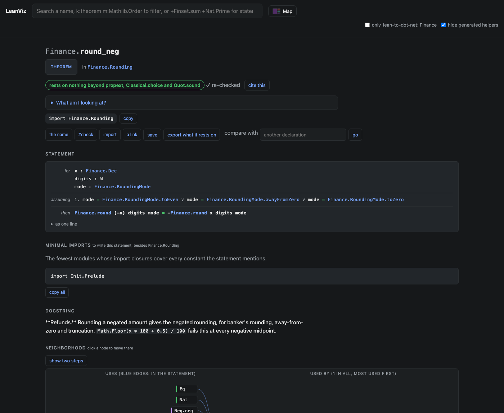

# Lean to .NET

[](https://github.com/keithadler/lean-to-dot-net/actions/workflows/ci.yml)
[](LICENSE)
[](lean/lean-toolchain)
[](global.json)
[](https://marketplace.visualstudio.com/items?itemName=keithadler.lean-to-dot-net)
[](https://open-vsx.org/extension/keithadler/lean-to-dot-net)

**Prove a function in Lean 4, call it from C#.** `lean2il` reads the compiled Lean with
[Tenet](https://github.com/keithadler/tenet), an independent Lean kernel on .NET, re-checks every proof,
and then compiles the definitions you mark with `@[export]` straight to an IL assembly. It writes the
documentation too, from the Lean: each method's summary is its docstring, its remarks are the theorems
proved about it, and its examples are proved equations turned into C# calls, every one of them run against
the IL before it is written down.

It runs wherever .NET 10 and Lean do: **macOS, Linux and Windows**, all three built and tested on every push.


**Start here:** the [tutorial](docs/tutorial.md) takes you from nothing to a proved Lean function called from
C# in about fifteen minutes. The [guide](docs/guide.md) covers every option, what compiles, how Lean types map to
.NET, how the docs are chosen, and what each error means.

## The pieces, in plain terms

- **[Lean 4](https://lean-lang.org)** is a programming language that is also a proof assistant. You write a
  function, you write theorems about it (*this never returns more than that*, *this is symmetric*), and Lean
  checks every step of every proof. The checking is done by Lean's *kernel*, a small program that everything
  else rests on.
- **[Tenet](https://github.com/keithadler/tenet)** is a second, independent implementation of that kernel,
  written in C# on .NET from the type theory, sharing no code with Lean. It re-checks every declaration of a
  compiled Lean project from scratch; it re-checks all of Mathlib, and it rejects a corpus of deliberately
  broken files, which is how you know it is checking rather than agreeing. A proof two independent kernels
  accept is one you can trust a little more.
- **lean2il**, this repository's compiler, asks Tenet to re-check the project, refuses to go on if Tenet rejects
  anything, then compiles the definitions you mark to .NET IL and writes their documentation from the Lean.
- **The VS Code extension** shows, wherever you are in Lean or C#, what was proved about the code in front of
  you, and builds the assembly for you.
- **[LeanViz](https://github.com/keithadler/leanviz)** renders the project's theorems as browsable pages; the
  generated docs link to them.

The demo is money. .NET's `Math.Round` has three well-known traps in finance code, and this repository
replaces all three with one function proved in Lean:

| What the code does | Input | Gives | Proved | Why |
|---|---|---|---|---|
| `Math.Round(x, 2)` | `0.125m` | `0.12` | `0.13` | the default mode is banker's rounding |
| `Math.Round((double)x, 2, AwayFromZero)` | `1.005` | `1` | `1.01` | 1.005 is 1.00499999... as a `double` |
| `Math.Floor(x * 100 + 0.5m) / 100` | `-2.675m` | `-2.67` | `-2.68` | the hand-rolled fix is not symmetric: a refund comes out a cent short |

The `double` row is not a corner case. Of the 10,000 prices from 0.005 to 99.995 that end in a half cent,
**572 round the wrong way as `double`** on .NET 10 (`HowOftenDoubleGetsAHalfCentWrong` counts them).

```csharp
using Finance;

Proven.Round(0.125m, 2, RoundingMode.AwayFromZero);   // 0.13, proved by invoice_example
Proven.Round(-2.675m, 2, RoundingMode.AwayFromZero);  // -2.68, proved by refund_example
Proven.RoundCents(19.995m);                            // 20.00, proved by roundCents_example
Proven.SplitEven(10000, 3);                            // [3334, 3333, 3333], proved by splitEven_example
```

And one more trap every billing system meets: split a $100.00 bill three ways as `total / 3` each and a cent
disappears. `Proven.SplitEven` gives the first `total % n` people the extra cent, and it is proved that the
shares always add up to exactly the total, refunds included, and never differ by more than a cent.

## What is proved

[`lean/Finance/Rounding.lean`](lean/Finance/Rounding.lean) defines rounding on exact decimals, a mantissa and
a scale like `System.Decimal`, for all five of .NET's `MidpointRounding` modes, and
[`lean/Finance/Split.lean`](lean/Finance/Split.lean) splits a bill, by recursion over a list. They prove:

| Theorem | Says |
|---|---|
| `round_error_le_half` | The result is within half a unit of its last digit (the two midpoint modes). |
| `round_nearest` | No other value with that many digits is closer. |
| `round_tie_awayFromZero` | An exact midpoint goes to the neighbor further from zero. |
| `round_tie_toEven` | An exact midpoint goes to the neighbor whose last digit is even. |
| `round_neg` | `round (-x) = -(round x)`: a refund rounds to minus its sale. |
| `round_round` | Rounding twice to the same precision is rounding once. |
| `round_of_scale_le` | A value already at the precision is returned unchanged. |
| `roundDiv_toEven_eq_awayFromZero` | Banker's rounding and away-from-zero differ only on exact ties. |
| `double_rounding_example` | Rounding 2.4449 to three places and then two gives 2.45; directly, 2.44. |
| `splitEven_sum` | The shares of a split add up to exactly the total, for any number of people, refunds included. |
| `splitEven_fair` | Every share is the total divided by `n`, rounded down, or one cent more. |
| `splitEven_length` | There are exactly `n` shares. |

plus floor, ceiling and truncation specs for the directed modes, and the worked examples above. Every
theorem rests on at most Lean's three standard axioms (`propext`, `Quot.sound`, `Classical.choice`); none
on `sorry`. Browse them in [LeanViz](https://keithadler.github.io/lean-to-dot-net/leanviz/?p=finance#/d/Finance.round_neg):



And a test makes the comparison the theorems invite: 300,000 random decimals, over every scale and all five
modes, with midpoints heavily over-represented, through `Proven.Round` and through .NET's
`Math.Round(decimal, int, MidpointRounding)`. They agree on every one. .NET's `decimal` rounding is
correct; the bugs above come from its default and from `double`.

## How it works

```
 Lean source ──lake build──▶ .olean ──Tenet──▶ re-checked kernel terms ──lean2il──▶ Finance.Proven.dll
 (definitions,                (Lean's            (an independent            (IL)       Finance.Proven.xml
  theorems,                    compiled           kernel; nothing is                    Finance.Proven.md
  docstrings)                  output)            emitted if it rejects)                Finance.Proven.proof.json
```

1. **Re-check.** `lean2il` maps the project's `.olean` files with Tenet and re-checks every declaration.
   By default that covers Lean's own library under the project too (64,855 declarations here, about a
   minute and a half); `--trust-imports` checks only the project. If Tenet rejects anything, nothing is emitted.
2. **Get the equations of recursive definitions.** Lean turns a recursive definition into a term built on
   `brecOn` or `WellFounded.fix`, which says nothing a machine can run well. But Lean also proves, for every
   recursive `f`, the equation `f.eq_def : ∀ xs, f xs = rhs`, where `rhs` is the body as written. lean2il has
   Lean generate those equations (in a small module it writes, `.lake/lean2il/Lean2IlEqns.lean`), Tenet re-checks
   them with everything else, and each recursive method is compiled from its equation's right-hand side. The IL
   computes something both kernels agree equals `f`. This covers Lean's own library too: `List.map`,
   `List.foldr`, `List.reverse` and friends compile the same way.
3. **Compile the kernel term.** The input is the term Tenet just checked, not Lean's compiler IR, so the IL
   computes the function the theorems are about. Kernel terms are not written for running, so compilation
   is mostly partial evaluation: type-class instances, coercions and numerals are unfolded; `Nat` and `Int`
   operations become `BigInteger` calls with Lean's meaning (Euclidean division, truncated `Nat`
   subtraction, `x / 0 = 0`); a `match` or `if` is a recursor, reduced at compile time when its target is a
   known constructor and turned into a branch otherwise; types and proofs are erased, and `Decidable` keeps
   its answer and drops its proof. A call to itself in tail position becomes a jump, so a loop runs in constant
   stack; any other recursion that outgrows the stack is rerun, transparently, on a thread with a 1 GB stack.
   That is safe to do because a compiled Lean function has no side effects.
4. **Emit.** A structure becomes a sealed class, an enum-like inductive a .NET enum, each export a static
   method. A structure shaped like a decimal (an `Int` and a `Nat`) also gets a `decimal` overload, so the
   Lean `round (x : Dec) (digits : Nat) (mode : RoundingMode) : Dec` is callable as
   `decimal Round(decimal x, int digits, RoundingMode mode)`. The assembly is written with
   `PersistedAssemblyBuilder` against the reference assemblies, so any .NET 10 project can reference it.
5. **Document and replay.** Every theorem of the form `f args = result` with literal arguments becomes a C#
   example. Before it is written down it is run against the new assembly through both overloads and must
   return the proved value. `ProvenInfo.Verdict` and `ProvenInfo.Theorems()` carry the result into the
   assembly itself.
6. **Test against Lean's own compiler.** Every export is run on 100 random inputs twice: by Lean, through its
   own compiler (`lean --run`, which shares no code with lean2il), and by the IL. The build fails on the first
   disagreement and names the input. It catches real bugs: counting a string's length in UTF-16 units instead
   of characters fails it at once, on `"a7zßz😀"`.

## Docs from Lean

The question this answers: can Lean's own documentation be the .NET documentation? Almost all of it can,
and all of it is read from the compiled `.olean`, the same file the proofs are in.

| From Lean | Becomes |
|---|---|
| A definition's docstring (`/-- ... -/`) | the method's `<summary>` in IntelliSense and its section in the Markdown |
| Docstrings of a structure's fields and an enum's constructors | the docs of the .NET fields and enum members |
| Documented theorems that mention the definition | its `<remarks>`: name, statement, what it rests on, a LeanViz link |
| Proved equations with literal arguments (`round ⟨125, 3⟩ 2 .awayFromZero = ⟨13, 2⟩`) | `<example>`: `Proven.Round(0.125m, 2, RoundingMode.AwayFromZero); // 0.13`, replayed on the IL |
| The module docstring (`/-! ... -/`) | the introduction of the Markdown |
| Declaration ranges | links to the exact source lines |

The rule for what appears is one line: **a theorem with a docstring is documentation; a helper lemma
without one is not.** Statements are printed with [LeanViz](https://github.com/keithadler/leanviz)'s printer,
and the same project renders as a browsable LeanViz site, so every theorem in the .NET docs links to its own
page. Lean's other documentation tools fit around this rather than inside it:
[doc-gen4](https://github.com/leanprover/doc-gen4) renders the whole library as Lean users read it, and
[Verso](https://github.com/leanprover/verso) is how to write long-form, checked prose about it.

## The VS Code extension

`vscode/` builds `lean-to-dot-net-0.4.0.vsix`. **It brings lean2il and Tenet with it**, so the VSIX alone is
enough: install it, open a Lean project, and build. It needs the .NET 10 runtime and Lean, and offers to install
either if it is missing.

- **In C#**, every call to a compiled function carries a lens, *proved in Lean, re-checked by Tenet*, that opens
  the Lean definition, and a hover with the signatures, the docstring, the proved examples and the theorems.
  `Proven.` completes with what is proved about each method.
- **In Lean**, a lens over each `@[export]` definition shows the C# signature and what stands behind it; over a
  proved example, the call and the value it returned on the IL.
- **The Proofs view** in the Activity Bar lists every assembly, function, replayed example and theorem, and
  **the Proof Dashboard** puts them on one page with the statements and the axioms under each.
- **Build .NET Assembly** runs `lake build` and `lean2il` in a terminal; Lean errors, lean2il's refusals and
  Tenet rejections go to the Problems panel on the right line. Optionally on every save.
- A **walkthrough** on the Welcome page, and Lean **snippets** for an exported definition and a proved example.
- It says when what it shows is **out of date**: after an edit, or when the last build failed.
- Tested: unit tests for its parsing, and an integration suite that runs it in a real VS Code, builds, and checks
  every lens, hover and completion (`npm test`, `npm run test:integration`).


## Getting started

**The quickest way:** install **Lean to .NET** from the
[VS Code Marketplace](https://marketplace.visualstudio.com/items?itemName=keithadler.lean-to-dot-net) (search
"Lean to .NET" in the Extensions view), or from a terminal:

```bash
code --install-extension keithadler.lean-to-dot-net
```

Using Cursor, Windsurf or VSCodium? It's on [Open VSX](https://open-vsx.org/extension/keithadler/lean-to-dot-net)
too: search "Lean to .NET" in their Extensions view.

Then open a Lean project, mark a definition `@[export]`, and run **Lean to .NET: Build .NET Assembly**.
The VSIX is also attached to each [release](https://github.com/keithadler/lean-to-dot-net/releases/latest).

**From source**, for the command line, the tests and the demo:

```bash
git clone https://github.com/keithadler/lean-to-dot-net
cd lean-to-dot-net
./setup.sh
```

`setup.sh` installs what is missing and builds everything: [elan](https://github.com/leanprover/elan) (Lean's
version manager, which then fetches the exact Lean in `lean/lean-toolchain`) and the .NET 10 SDK into
`~/.dotnet`, both from their official installers. **Tenet needs no installing:** the compiler references the
`Tenet.Olean` package from nuget.org, and the `tenet` command-line checker is pinned in
[`dotnet-tools.json`](dotnet-tools.json), so `dotnet tool restore` fetches it. On Windows, `setup.ps1` does
the same. Once set up, `./build.sh` rebuilds and retests everything, and `./build.sh --full` has Tenet
re-check Lean's own library too.

`setup.sh` also installs `lean2il` as a .NET global tool (in `~/.dotnet/tools`) and the VS Code extension.
To use it in your own Lean project, mark what to compile and run `lean2il` on the project (the
[tutorial](docs/tutorial.md) walks through this end to end):

```lean
/-- What the .NET docs will say about it. -/
@[export my_function]
def myFunction (x : Int) (n : Nat) : Int := ...
```

```bash
lake build
lean2il .
```

and reference `.lake/dotnet/<Namespace>.Proven.dll` and `.lake/dotnet/LeanToDotNet.Runtime.dll` from C#.

**In a .NET project, on every build:** add the [`LeanToDotNet.Build`](https://www.nuget.org/packages/LeanToDotNet.Build)
package and list your Lean project:

```xml
<ItemGroup>
  <PackageReference Include="LeanToDotNet.Build" Version="0.3.1" />
  <LeanProject Include="../lean" />
</ItemGroup>
```

`dotnet build` then runs `lake build` and lean2il (bundled in the package, Tenet included) before the C# compiler,
references the proven assembly with its IntelliSense docs, and copies it to the output. A broken proof fails the
.NET build with Lean's message at its line, in the form Visual Studio and Rider make clickable. Nothing reruns until a `.lean` file changes. You need Lean and the .NET 10 SDK;
[`tests/package-smoke.sh`](tests/package-smoke.sh) does exactly this from scratch, in CI on Linux, macOS and
Windows.

## What the compiler supports

| Lean | .NET |
|---|---|
| `Nat`, `Int` | `BigInteger` (a negative `Nat` argument is refused) |
| `Bool`, `Decidable p` | `bool` |
| `String` | `string`; lengths count characters, as Lean's do |
| `List α` | `LeanList<T>`, immutable; C# can pass an array where one is expected |
| `Option α` | `LeanOption<T>` |
| `Array α` | `LeanArray<T>`, backed by a .NET array: constant-time `a[i]` and `size`, linear `push` loops; C# passes a `T[]` |
| `UInt8` ... `UInt64`, `Int8` ... `Int64` | `byte` ... `ulong`, `sbyte` ... `long`: wrapping arithmetic, and Lean's meaning where C#'s differs (`x / 0 = 0`, shift counts wrap) |
| a structure, an enum-like inductive | a sealed class, a .NET enum |
| an inductive with data, or recursive (trees, syntax, results) | an abstract class with a `Tag` and a sealed nested class per constructor |
| a type with parameters, `Pair Int String` | a class per use, `PairOfIntString` |
| a structure of an `Int` and a `Nat` | also `decimal`, through an overload |

Definitions compile with `if`, `match`, `let`, instances, numerals and coercions, and **recursion**: structural
or well-founded, your own or Lean's library's (`List.map`, `foldr`, `filter`, `Array.foldl`, `++`, `sum`).
Lambdas compile, including ones that use local variables: `xs.map (fun x => x + k)` becomes a copy of
`List.map` that takes `k` as a parameter. No delegates, no allocation per call.

Not yet, and refused with a message that says why rather than compiled wrong: `Float`, `Char`, a function stored
or returned as a value, and inductive types with indices, mutual inductives, or a type nested in itself through
a `List`.
[`examples/showcase`](examples/showcase) shows every supported feature, and the build compiles and
differential-tests it every time.

## What this rests on

- Lean's kernel, which accepted every proof, and Tenet, which accepted them again independently, together with
  the equation lemmas recursive functions are compiled from.
- `lean2il`'s translation from kernel terms to IL. It is not proved. It is tested, three ways, on every build:
  the proved examples are replayed; every export is run on random inputs by Lean's own compiler and by the IL,
  which must agree; and the test suite checks the runtime against Lean's `#eval` output and `Proven.Round`
  against `Math.Round(decimal)` on 300,000 inputs.
- `LeanToDotNet.Runtime`: `BigInteger` arithmetic with Lean's meaning, strings with Lean's lengths, immutable lists,
  and the exact `decimal` conversion, which refuses a value with no `decimal` form rather than rounding it.

## Layout

| Path | |
|---|---|
| [`lean/`](lean) | the Lake project: `Finance/Rounding.lean` and `Finance/Split.lean`, definitions and proofs |
| [`examples/showcase/`](examples/showcase) | recursion, lists, options, strings, lambdas, your own types, fixed-width integers and arrays, compiled and differential-tested on every build |
| [`src/Lean2Il/`](src/Lean2Il) | the compiler: `Compiler.cs` (kernel term to IL), `Equations.cs` (equation lemmas), `Differential.cs` (Lean vs IL), `Docs.cs` (docs and replay), `Primitives.cs` |
| [`src/LeanToDotNet.Runtime/`](src/LeanToDotNet.Runtime) | what the emitted assembly calls: `LeanNat`, `LeanInt`, `LeanList`, `LeanOption`, `LeanString`, `LeanStack`, `DecimalBridge` |
| [`tests/`](tests) | runtime against Lean, `Proven.Round` against `Math.Round(decimal)`, the three bugs |
| [`samples/Invoice/`](samples/Invoice) | a console app: the three bugs next to the proved fix |
| [`vscode/`](vscode) | the VS Code extension |
| [`docs/`](docs) | [tutorial](docs/tutorial.md), [guide](docs/guide.md), the [generated API docs](docs/Finance.Proven.md), the LeanViz site |

## License

MIT. `src/Lean2Il/Vendor/Pretty.cs` is from [LeanViz](https://github.com/keithadler/leanviz), also MIT.
