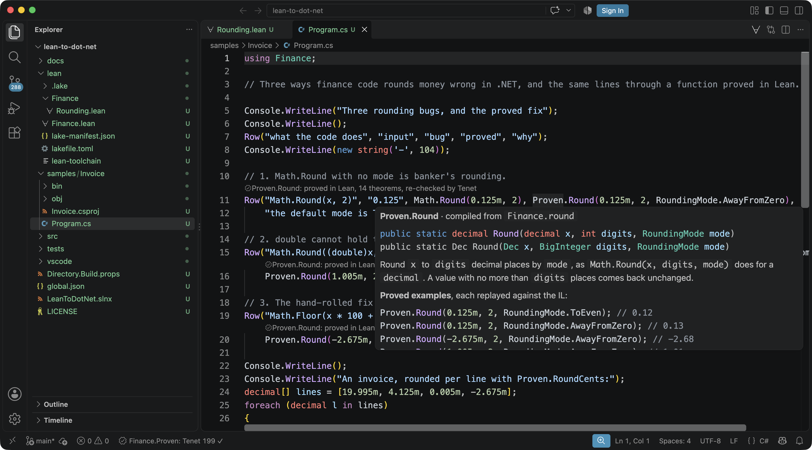
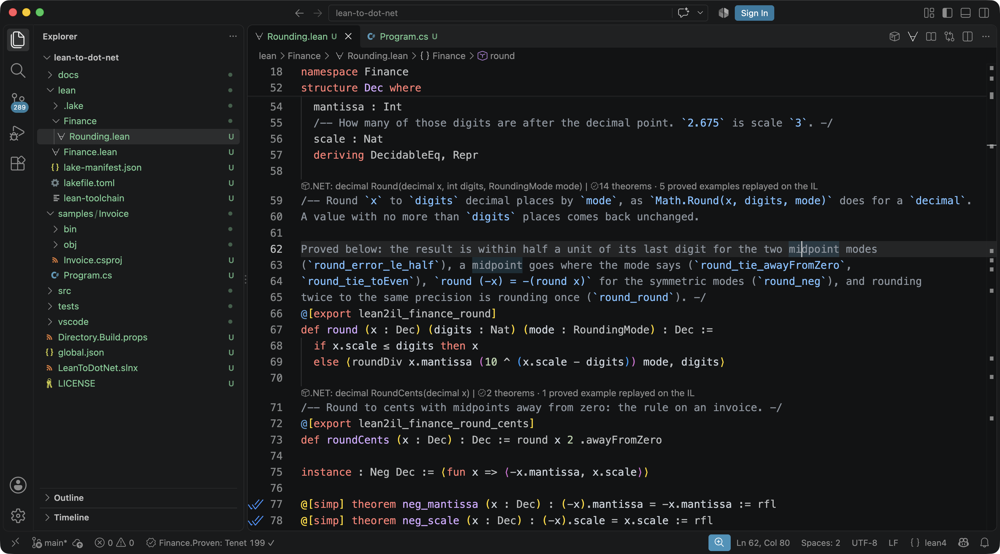
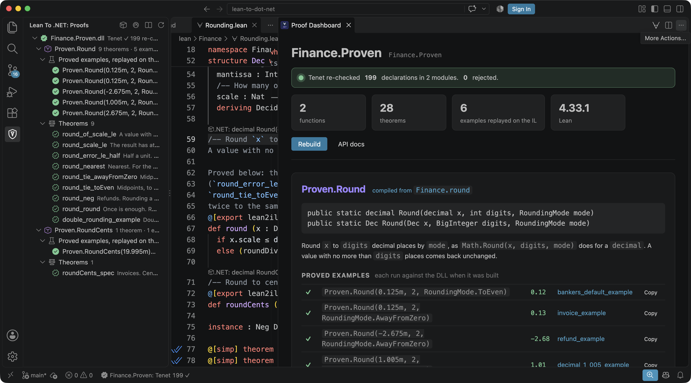
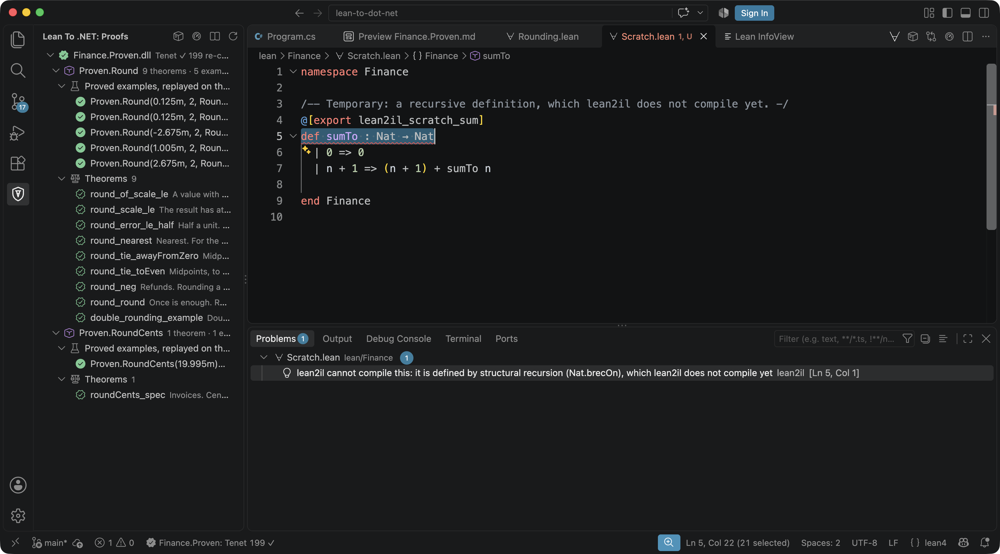

# Lean to .NET

**Prove a function in Lean 4, call it from C#, and see the proofs behind every call.**

This is the editor half of [lean-to-dot-net](https://github.com/keithadler/lean-to-dot-net). Its compiler,
`lean2il`, re-checks a Lean project with [Tenet](https://github.com/keithadler/tenet), an independent Lean
kernel, compiles the definitions you mark with `@[export]` to a .NET assembly, and writes the documentation
from the Lean. This extension builds it for you and puts what was proved wherever you are looking.

## What it does

**In C#.** Every call to a compiled function carries a lens, *proved in Lean, 9 theorems, re-checked by
Tenet*, that opens the Lean definition. Hover it for the signatures, the docstring, the proved examples and
the theorems, each a link to its line. Type `Proven.` for completions that say what is proved about each method.

**In Lean.** A lens over each `@[export]` definition gives the C# signature it became and how many theorems
and replayed examples stand behind it. A lens over each documented theorem names the .NET methods whose docs
it appears in; over a proved example, the C# call and the value it returned.

**The Proofs view.** An Activity Bar view lists each assembly with Tenet's verdict, each compiled function,
its proved examples (copy one as a C# call) and its theorems (hover for the statement and the axioms under
it, open it in LeanViz). Click anything to go to the Lean.

**The Proof Dashboard.** One page per assembly: the verdict, the counts, and for each function its
signatures, its examples with a check for each one replayed on the IL, and every theorem with its statement
and the axioms it rests on.

**Building.** *Lean to .NET: Build .NET Assembly* (or the package icon over a Lean file) runs `lake build` and
`lean2il` in its own terminal. Lean's errors, lean2il's refusals and anything Tenet rejects land in the
Problems panel on the line they are about. Turn on `lean2dotnet.buildOnSave` to rebuild on every save.

**Getting started.** A walkthrough on the Welcome page goes from installing Lean to calling a proved function
from C#. Type `export` in a Lean file for a snippet of an exported definition with its docstring, or
`proved-example` for an example lean2il will turn into a tested C# call.

## What is Tenet?

Lean checks every proof with its kernel, a small program everything else rests on. Tenet is a second,
independent implementation of that kernel, written in C# from the type theory, sharing no code with Lean. It
re-checks all of Mathlib. When lean2il builds an assembly, Tenet re-checks every declaration first, and if it
rejects anything, nothing is emitted. A proof that two independent kernels accept is one you can trust a
little more.

## Requirements

- `lean2il`: clone [lean-to-dot-net](https://github.com/keithadler/lean-to-dot-net) and run `./setup.sh`,
  which installs Lean (through elan) and the .NET 10 SDK if they are missing. Tenet comes from NuGet; there
  is nothing to install for it. The extension finds `lean2il` on the PATH or built in the workspace.
- The official [Lean 4 extension](https://marketplace.visualstudio.com/items?itemName=leanprover.lean4) for
  Lean syntax and the infoview.

## Settings

| Setting | Default | |
|---|---|---|
| `lean2dotnet.lean2ilCommand` | empty | How to run lean2il, when it is not on the PATH or in the workspace. |
| `lean2dotnet.checkImports` | `false` | Have Tenet re-check Lean's own library under the project too. Slower, strongest. |
| `lean2dotnet.buildOnSave` | `false` | Rebuild when a `.lean` file is saved. |
| `lean2dotnet.leanvizUrl` | empty | A LeanViz site for the project, for theorem links. |
| `lean2dotnet.codeLens` | `true` | Proof lenses in Lean and C#. |

Everything the extension shows comes from the `.proof.json` lean2il writes beside the assembly, so it is
exactly what the last build proved.
